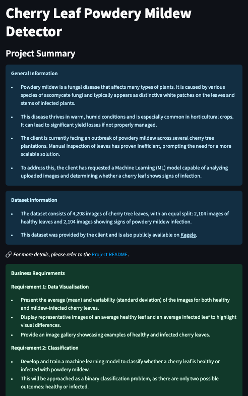
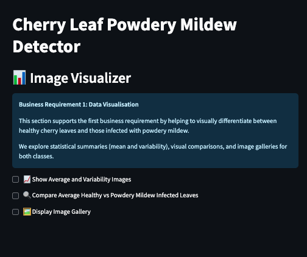
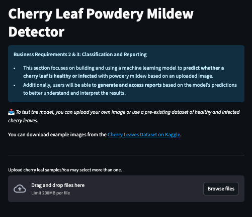
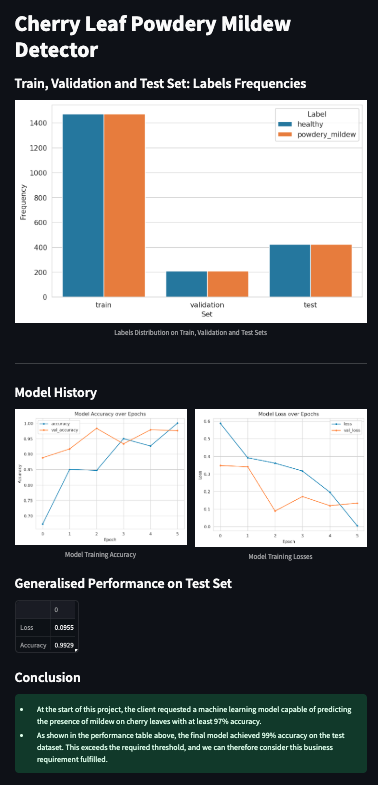

# Mildew Detection in Cherry Leaves


## Table of Contents
1. [Introduction](#introduction)
2. [Dataset Content](#dataset-content)
3. [Business Requirements](#business-requirements)
4. [Hypotheses and validation](#hypothesis-and-how-to-validate)
5. [The Rationale to Map the Business Requirements to the Data Visualisations and ML tasks](#the-rationale-to-map-the-business-requirements-to-the-data-visualisations-and-ml-tasks)
   - [Answering Business Requirement 1](#business-requirement-1-data-visualisation)
   - [Answering Business Requirement 2](#business-requirement-2-classification)
   - [Answering Business Requirement 3](#business-requirement-3-report)
6. [ML Business Case](#ml-business-case)
7. [Dashboard Design](#dashboard-design)
8. [Unfixed Bugs](#unfixed-bugs)
9. [Deployment](#deployment)
    1. [Render](#render)
10. [Main Data Analysis and Machine Learning Libraries](#main-data-analysis-and-machine-learning-libraries)
11. [Other technologies used](#other-technologies-used)
12. [Testing](#testing)
    1. [Python Validation](#python-validation)
13. [Credits](#credits)
    1. [Content](#content)
    2. [Media](#media)
14. [Acknowledgements](#acknowledgements)

## Introduction

This project is a data science and machine learning (ML) project that uses predictive analytics to tell the difference between 2 different sets of images.
The business goal is to assist the client, who is dealing with an infestation of powdery mildew in its cherry tree plantations.

## Dataset Content

- The dataset is sourced from [Kaggle](https://www.kaggle.com/codeinstitute/cherry-leaves). We then created a fictitious user story where predictive analytics can be applied in a real project in the workplace.
- The dataset contains +4 thousand images taken from the client's crop fields. The images show healthy cherry leaves and cherry leaves that have powdery mildew, a fungal disease that affects many plant species. The cherry plantation crop is one of the finest products in their portfolio, and the company is concerned about supplying the market with a compromised quality product.

## Business Requirements

The cherry plantation crop from Farmy & Foods is facing a challenge where their cherry plantations have been presenting powdery mildew. Currently, the process is manual verification if a given cherry tree contains powdery mildew. An employee spends around 30 minutes in each tree, taking a few samples of tree leaves and verifying visually if the leaf tree is healthy or has powdery mildew. If there is powdery mildew, the employee applies a specific compound to kill the fungus. The time spent applying this compound is 1 minute. The company has thousands of cherry trees located on multiple farms across the country. As a result, this manual process is not scalable due to the time spent in the manual process inspection.

To save time in this process, the IT team suggested an ML system that detects instantly, using a leaf tree image, if it is healthy or has powdery mildew. A similar manual process is in place for other crops for detecting pests, and if this initiative is successful, there is a realistic chance to replicate this project for all other crops. The dataset is a collection of cherry leaf images provided by Farmy & Foods, taken from their crops.

- 1 - The client is interested in conducting a study to visually differentiate a healthy cherry leaf from one with powdery mildew.
- 2 - The client is interested in predicting if a cherry leaf is healthy or contains powdery mildew.
- 3 - The client is interested in being able to download the reports made so that they can keep a record of the predicitions.

## Hypothesis and how to validate?

- Null Hypothesis (H₀): A binary classification model cannot accurately predict mildew presence on cherry leaves.
- Alternative Hypothesis (H₁): A binary classification model can accurately predict mildew presence on cherry leaves.

- We suspect cherry leaves with powdery mildew have visual defects, normally this is indicated by numerous white/ grayish powdery spots covering a large area of the leaf, compared to that of healthy cherry leaves.
  - An average image study can assist in the investigation.

## The Rationale to Map the Business Requirements to the Data Visualisations and ML Tasks

- ### Business Requirement 1: Data Visualisation
  - The average (mean) and variability (standard deviation) of the images for, healthy and mildew cherry leaves, will be presented.
  - An average healthy cherry leaf and an average mildew infected leaf will also be displayed to show the differentiation of each.
  - We will display a gallery of images for healthy cherry leaves or mildew infected leaves.

- ### Business Requirement 2: Classification
  - We will create and fit an ML model to predict if a leaf is healthy or infected with powdery mildew. This will be a binary classification task as there are only 2 categories to identify.

- ### Business Requirement 3: Report
  - We want to generate reports of the model that is accessible to all users so that the data can be interpreted and understood.

## ML Business Case

- Based on existing data, we want to predict if a cherry leaf is infected with podwery mildew or not, through the use of a machine learning model. It will be a supervised model, a binary classification model.
- Ideally, this should eliminate the timely process of allocating a team member to diagnose whether a leaf has mildew or not and effectively deduce the outcome through this model.
- The model success metrics are: 99% accuracy
- The model output is defined as a flag, identifying if the leaf has mildew or not, along with it comes its respective probability of being infected or not. The staff should upload the picture to the app and a prediction will be made.
- The training data to fit the model comes from [Kaggle](https://www.kaggle.com/codeinstitute/cherry-leaves). 

## Dashboard Design

The dashboard was made using Streamlit and has been designed to be easy to use and functional. It contains the following:

1. Project Summary



This is the primary page the user is introduced with. It is intended to provide a new user with relevant information that explains what the entire application is trying to achieve.

* General Information
* Dataset Information
* Link to README.md
* Business Requirements

2. Image Visualiser



This page contains the following:

* Business Requirement 1
* Checkbox I: Show Average and Variability Images
* Checkbox II: Show Comparison of Average Healthy and Powdery Mildew Images
* Checkbox III: Image Gallery

3. Mildew Detector



This page contains the following:

* Business Requirements 2 and 3
* Link to Kaggle Dataset used in the Project
* Button to upload images to make predictions on
* Link to download report in .csv format

4. Project Hypotheses

5. Performance Metrics



This page contains the following:

* Train, Validation and Test Set: Label Frequencies
* Model History
* Generalised Performance on Test Set
* Conclusion

[Back to top](#table-of-contents)

## Unfixed Bugs

- No known unfixed bugs

## Deployment

### Render

- The App live link is: `[https://mildew-detection-in-cherry-leaves-p5.onrender.com/]`
- The project was deployed to render.com using the following steps.

1. Log in to Render and click the **+New** button in the top right hand corner.
2. Then select the **Web Service** option.
3. Select your repository name.
4. In the Start Command section you should write: ```streamlit run app.py```
5. The deployment process should happen smoothly if all deployment files are fully functional. Click the link at the top of the page beneath your repository to access your App.

## Main Data Analysis and Machine Learning Libraries

The main libraries used were: 
* numpy 1.26.1 - used to convert information to arrays
* pandas 2.1.1 - used for converting information to a dataframe and saving as such
* matplotlib 3.4.0 - used to plot the distribution of datasets
* seaborn 0.13.2 - used for making statistical graphics
* plotly 5.10.0 - used for plotting results of ML model training
* Pillow 10.0.1 - used to adjust images
* streamlit 1.40.2 - used to create the dashboard's interface
* joblib 1.4.2 - used for runnning tasks in parallel
* scikit-learn 1.3.1 - used for model evaluation
* tensorflow-cpu 2.16.1 - used for model creation
* keras 3.0.0 - used to set hyperparameters for the model

[Back to top](#table-of-contents)

## Other technologies used

* Streamlit - used for dashboard development

* Render - used to deploy the project as a web app.

* Git/GitHub - used for version control and code storage

* Gitpod - IDE used to develop the project

* Am I responsive - used to produce screenshots of the project.

[Back to top](#table-of-contents)

## Testing

### Python Validation

## Credits

- [ChatGPT](https://www.chat.openai.com) was used for gathering information on powdery mildew and assistance in refactoring some of the code
- The cherry_leaves dataset was created by Code institute and taken from [Kaggle](https://www.kaggle.com/codeinstitute/cherry-leaves)
- [YouTube](https://www.youtube.com) was used for assistance on creating the streamlit dashboard
- The Malaria Walkthrough Project from Code Institute was used extensively throughout the course of this project.
- I have accredited streamlit documentation in the code itself when I used it to help out.

## Acknowledgements

- I would like to thank my mentor, Mo Shami, for providing guidance during my project.

[Back to top](#table-of-contents)
