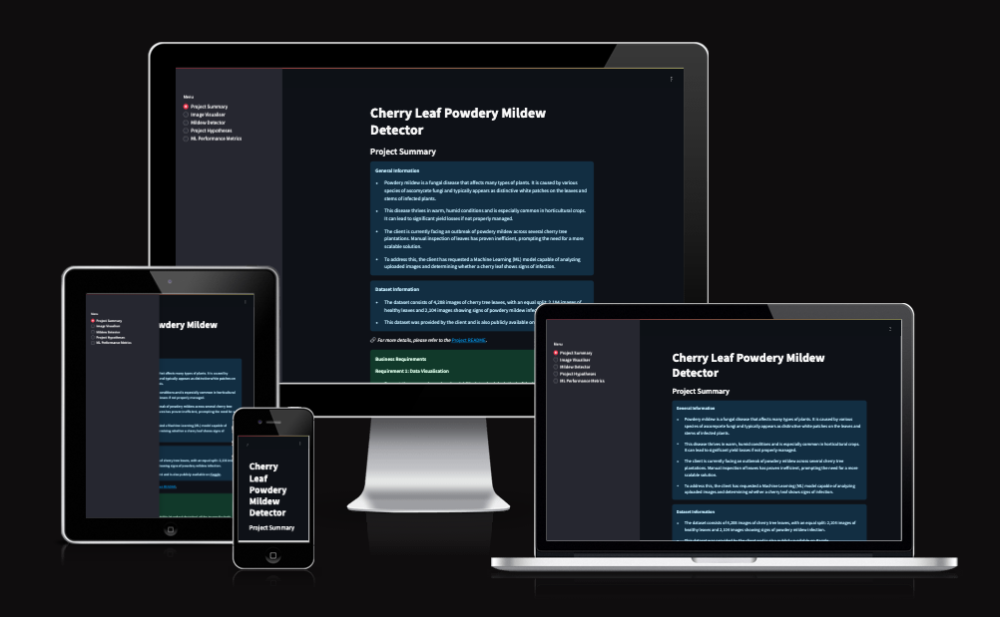

# Mildew Detection in Cherry Leaves

## Table of Contents
1. [Introduction](#introduction)
2. [Dataset Content](#dataset-content)
3. [Business Requirements](#business-requirements)
4. [Hypotheses and validation](#hypothesis-and-how-to-validate)
5. [The Rationale to Map the Business Requirements to the Data Visualisations and ML tasks](#the-rationale-to-map-the-business-requirements-to-the-data-visualisations-and-ml-tasks)
   - [Answering Business Requirement 1](#business-requirement-1-data-visualisation)
   - [Answering Business Requirement 2](#business-requirement-2-classification)
   - [Answering Business Requirement 3](#business-requirement-3-report)
6. [ML Business Case](#ml-business-case)
7. [Dashboard Design](#dashboard-design)
8. [Unfixed Bugs](#unfixed-bugs)
9. [Deployment](#deployment)
    1. [Heroku](#heroku)
10. [Main Data Analysis and Machine Learning Libraries](#main-data-analysis-and-machine-learning-libraries)
11. [Other technologies used](#other-technologies-used)
12. [Testing](#testing)
    1. [Python Validation](#python-validation)
13. [Credits](#credits)
    1. [Content](#content)
    2. [Media](#media)
14. [Acknowledgements](#acknowledgements)

## Introduction

This project is a data science and machine learning (ML) project that uses predictive analytics to tell the difference between 2 different sets of images.
The business goal is to assist the client, who is dealing with an infestation of powdery mildew in its cherry tree plantations.

## Dataset Content

- The dataset is sourced from [Kaggle](https://www.kaggle.com/codeinstitute/cherry-leaves). We then created a fictitious user story where predictive analytics can be applied in a real project in the workplace.
- The dataset contains +4 thousand images taken from the client's crop fields. The images show healthy cherry leaves and cherry leaves that have powdery mildew, a fungal disease that affects many plant species. The cherry plantation crop is one of the finest products in their portfolio, and the company is concerned about supplying the market with a compromised quality product.

## Business Requirements

The cherry plantation crop from Farmy & Foods is facing a challenge where their cherry plantations have been presenting powdery mildew. Currently, the process is manual verification if a given cherry tree contains powdery mildew. An employee spends around 30 minutes in each tree, taking a few samples of tree leaves and verifying visually if the leaf tree is healthy or has powdery mildew. If there is powdery mildew, the employee applies a specific compound to kill the fungus. The time spent applying this compound is 1 minute. The company has thousands of cherry trees located on multiple farms across the country. As a result, this manual process is not scalable due to the time spent in the manual process inspection.

To save time in this process, the IT team suggested an ML system that detects instantly, using a leaf tree image, if it is healthy or has powdery mildew. A similar manual process is in place for other crops for detecting pests, and if this initiative is successful, there is a realistic chance to replicate this project for all other crops. The dataset is a collection of cherry leaf images provided by Farmy & Foods, taken from their crops.

- 1 - The client is interested in conducting a study to visually differentiate a healthy cherry leaf from one with powdery mildew.
- 2 - The client is interested in predicting if a cherry leaf is healthy or contains powdery mildew.
- 3 - The client is interested in being able to download the reports made so that they can keep a record of the predicitions.

## Hypothesis and how to validate?

- Null Hypothesis (H₀): A binary classification model cannot accurately predict mildew presence on cherry leaves.
- Alternative Hypothesis (H₁): A binary classification model can accurately predict mildew presence on cherry leaves.

- We suspect cherry leaves with powdery mildew have visual defects, normally this is indicated by numerous white/ grayish powdery spots covering a large area of the leaf, compared to that of healthy cherry leaves.
  - An average image study can assist in the investigation.

## The Rationale to Map the Business Requirements to the Data Visualisations and ML Tasks

- ### Business Requirement 1: Data Visualisation
  - The average (mean) and variability (standard deviation) of the images for, healthy and mildew cherry leaves, will be presented.
  - An average healthy cherry leaf and an average mildew infected leaf will also be displayed to show the differentiation of each.
  - We will display a gallery of images for healthy cherry leaves or mildew infected leaves.

- ### Business Requirement 2: Classification
  - We will create and fit an ML model to predict if a leaf is healthy or infected with powdery mildew. This will be a binary classification task as there are only 2 categories to identify.

- ### Business Requirement 3: Report
  - We want to generate reports of the model that is accessible to all users so that the data can be interpreted and understood.

## ML Business Case

- Based on existing data, we want to predict if a cherry leaf is infected with podwery mildew or not, through the use of a machine learning model. It will be a supervised model, a binary classification model.
- Ideally, this should eliminate the timely process of allocating a team member to diagnose whether a leaf has mildew or not and effectively deduce the outcome through this model.
- The model success metrics are: TBC
- The model output is defined as a flag, identifying if the leaf has mildew or not, along with it comes its respective probability of being infected or not. The staff should upload the picture to the app and a prediction will be made.
- The training data to fit the model comes from [Kaggle](https://www.kaggle.com/codeinstitute/cherry-leaves). 

## Dashboard Design

- List all dashboard pages and their content, either blocks of information or widgets, like buttons, checkboxes, images, or any other items, that your dashboard library supports.
- Finally, during the project development, you may revisit your dashboard plan to update a given feature (for example, at the beginning of the project, you were confident you would use a given plot to display an insight, but later, you chose another plot type).

## Unfixed Bugs

- You will need to mention unfixed bugs and why they were unfixed. This section should include shortcomings of the frameworks or technologies used. Although time can be a significant variable for consideration, paucity of time and difficulty understanding implementation is not a valid reason to leave bugs unfixed.

## Deployment

### Heroku

- The App live link is: `https://YOUR_APP_NAME.herokuapp.com/`
- Set the runtime.txt Python version to a [Heroku-20](https://devcenter.heroku.com/articles/python-support#supported-runtimes) stack currently supported version.
- The project was deployed to Heroku using the following steps.

1. Log in to Heroku and create an App
2. At the Deploy tab, select GitHub as the deployment method.
3. Select your repository name and click Search. Once it is found, click Connect.
4. Select the branch you want to deploy, then click Deploy Branch.
5. The deployment process should happen smoothly if all deployment files are fully functional. Click the button Open App on the top of the page to access your App.
6. If the slug size is too large, then add large files not required for the app to the .slugignore file.

## Main Data Analysis and Machine Learning Libraries

- Here, you should list the libraries used in the project and provide an example(s) of how you used these libraries.

## Other technologies used

## Testing

### Python Validation

## Credits

- In this section, you need to reference where you got your content, media and from where you got extra help. It is common practice to use code from other repositories and tutorials. However, it is necessary to be very specific about these sources to avoid plagiarism.
- You can break the credits section up into Content and Media, depending on what you have included in your project.

### Content

- The text for the Home page was taken from Wikipedia Article A.
- Instructions on how to implement form validation on the Sign-Up page were taken from [Specific YouTube Tutorial](https://www.youtube.com/).
- The icons in the footer were taken from [Font Awesome](https://fontawesome.com/).

### Media

- The photos used on the home and sign-up page are from This Open-Source site.
- The images used for the gallery page were taken from this other open-source site.

## Acknowledgements

- Thank the people who provided support throughout this project.
